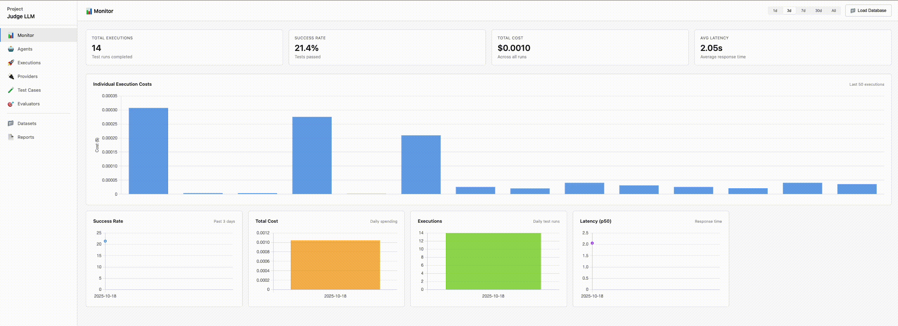

<div align="center">
  

  # JUDGE LLM

  A lightweight, extensible Python framework for **evaluating and comparing LLM providers**. Test your AI agents systematically with multi-turn conversations, cost tracking, and comprehensive reporting.

  [Quick Start](#quick-start) • [Demo](#demo) • [Features](#features) • [Examples](#testing-examples) • [Reports](#reports--dashboard)
</div>

<div align="center">
  
</div>

## Purpose

JUDGE LLM helps you **evaluate AI agents and LLM providers** by running test cases against your models and measuring:
- **Response quality** (exact matching, semantic similarity, ROUGE scores)
- **Cost & latency** (token usage, execution time, budget compliance)
- **Conversation flow** (tool uses, multi-turn interactions)
- **Safety & custom metrics** (extensible evaluation logic)

Perfect for regression testing, A/B testing providers, and ensuring production-grade quality.

## Features

- **Multiple Providers**: Gemini, Mock, and custom providers with registry-based extensibility
- **Built-in Evaluators**: Response similarity, trajectory validation, cost/latency checks
- **Custom Components**: Create and register custom providers, evaluators, and reporters
- **Registry System**: Register once in defaults, use everywhere by name
- **Rich Reports**: Console tables, interactive HTML dashboard, JSON exports, SQLite database, plus custom reporters
- **Parallel Execution**: Run evaluations concurrently with configurable workers
- **Quality Gates**: Fail CI/CD builds when thresholds are violated (configurable)
- **Config-Driven**: YAML configs with smart defaults or programmatic Python API
- **Default Config**: Reusable configurations with component registration
- **Per-Test Overrides**: Fine-tune evaluator thresholds per test case
- **Environment Variables**: Auto-loads `.env` for secure API key management

## Installation

### From Source

```bash
git clone https://github.com/yourusername/judge-llm.git
cd judge-llm
pip install -e .
```

### From PyPI (when published)

```bash
pip install judge-llm
```

### With Optional Dependencies

```bash
# Install with Gemini provider support
pip install judge-llm[gemini]

# Install with dev dependencies
pip install judge-llm[dev]
```

### Setup Environment Variables

JUDGE LLM automatically loads environment variables from a `.env` file:

```bash
# Copy the example file
cp .env.example .env

# Edit .env and add your API keys
nano .env
```

**`.env` file:**
```bash
# Google Gemini API Key
GOOGLE_API_KEY=your-google-api-key-here
```

The `.env` file is automatically loaded when you import the library or run the CLI. **Never commit `.env` to version control** - it's already in `.gitignore`.

## Quick Start

### CLI Usage

```bash
# Run evaluation from config file
judge-llm run --config config.yaml

# Run with inline arguments (supports .json, .yaml, or .yml)
judge-llm run --dataset ./data/eval.yaml --provider mock --agent-id my_agent --report html --output report.html

# Validate configuration
judge-llm validate --config config.yaml

# List available components
judge-llm list providers
judge-llm list evaluators
judge-llm list reporters

# Generate dashboard from database
judge-llm dashboard --db results.db --output dashboard.html
```

### Python API

```python
from judge_llm import evaluate

# From config file
report = evaluate(config="config.yaml")

# Programmatic API (supports .json, .yaml, or .yml datasets)
report = evaluate(
    dataset={"loader": "local_file", "paths": ["./data/eval.yaml"]},
    providers=[{"type": "mock", "agent_id": "my_agent"}],
    evaluators=[{"type": "response_evaluator", "config": {"similarity_threshold": 0.8}}],
    reporters=[{"type": "console"}, {"type": "html", "output_path": "./report.html"}]
)

print(f"Success: {report.success_rate:.1%} | Cost: ${report.total_cost:.4f}")
```

## Configuration

**Minimal config.yaml:**
```yaml
dataset:
  loader: local_file
  paths: [./data/eval.json]  # Supports .json, .yaml, or .yml files

providers:
  - type: gemini
    agent_id: my_agent
    model: gemini-2.0-flash-exp

evaluators:
  - type: response_evaluator
    config: {similarity_threshold: 0.8}

reporters:
  - type: console
  - type: html
    output_path: ./report.html
```

**Advanced config with quality gates:**
```yaml
agent:
  fail_on_threshold_violation: true  # Exit with error if evaluations fail (default: true)
  parallel_execution: true            # Run tests in parallel
  max_workers: 4                      # Number of parallel workers
  num_runs: 3                         # Run each test 3 times

dataset:
  loader: local_file
  paths: [./data/eval.yaml]

providers:
  - type: gemini
    agent_id: production_agent
    model: gemini-2.0-flash-exp

evaluators:
  - type: response_evaluator
    config:
      similarity_threshold: 0.85  # Minimum 85% similarity required
  - type: cost_evaluator
    config:
      max_cost_per_case: 0.05      # Maximum $0.05 per test

reporters:
  - type: database
    db_path: ./results.db  # Track results over time
```

**Use in CI/CD:**
```bash
# Fails with exit code 1 if any evaluator thresholds are violated
judge-llm run --config ci-config.yaml

# Or disable failures for monitoring
# Set fail_on_threshold_violation: false in config
```

**Dataset File Formats:**

JUDGE LLM supports both JSON and YAML formats for evaluation datasets. Use whichever format you prefer:

```yaml
# Using JSON dataset
dataset:
  loader: local_file
  paths: [./data/eval.json]

# Using YAML dataset
dataset:
  loader: local_file
  paths: [./data/eval.yaml]

# Using multiple datasets (mixed formats)
dataset:
  loader: local_file
  paths:
    - ./data/eval1.json
    - ./data/eval2.yaml

# Using directory loader with pattern
dataset:
  loader: directory
  paths: [./data]
  pattern: "*.yaml"  # or "*.json" or "*.yml"
```

See the [examples/](examples/) directory for complete configuration examples including default configs, custom evaluators, and advanced features.

## Custom Component Registration

JUDGE LLM supports registering custom providers, evaluators, and reporters for reuse across projects.

### Method 1: Register in Default Config

Create `.judge_llm.defaults.yaml` in your project root:

```yaml
# Register custom components once
providers:
  - type: custom
    module_path: ./my_providers/anthropic.py
    class_name: AnthropicProvider
    register_as: anthropic  # ← Use this name in test configs

evaluators:
  - type: custom
    module_path: ./my_evaluators/safety.py
    class_name: SafetyEvaluator
    register_as: safety

reporters:
  - type: custom
    module_path: ./my_reporters/slack.py
    class_name: SlackReporter
    register_as: slack
```

Then use them by name in any test config:

```yaml
# test.yaml - clean and simple!
providers:
  - type: anthropic  # ← Uses registered custom provider
    agent_id: claude

evaluators:
  - type: safety  # ← Uses registered custom evaluator

reporters:
  - type: slack  # ← Uses registered custom reporter
    config: {webhook_url: ${SLACK_WEBHOOK}}
```

### Method 2: Programmatic Registration

```python
from judge_llm import evaluate, register_provider, register_evaluator, register_reporter
from my_components import CustomProvider, SafetyEvaluator, SlackReporter

# Register components
register_provider("my_provider", CustomProvider)
register_evaluator("safety", SafetyEvaluator)
register_reporter("slack", SlackReporter)

# Use by name
report = evaluate(
    dataset={"loader": "local_file", "paths": ["./tests.json"]},
    providers=[{"type": "my_provider", "agent_id": "test"}],
    evaluators=[{"type": "safety"}],
    reporters=[{"type": "slack", "config": {"webhook_url": "..."}}]
)
```

**Benefits:**
- ✅ **DRY** - Register once, use everywhere
- ✅ **Team Standardization** - Share defaults across team
- ✅ **Clean Configs** - Test configs reference components by name
- ✅ **Easy Updates** - Change implementation in one place

See [examples/default_config_reporters/](examples/default_config_reporters/) for complete examples.

## Testing Examples

Explore **8 complete examples** in the `examples/` directory:

| Example | Description |
|---------|-------------|
| **01-gemini-agent** | Real Gemini API evaluation with response & trajectory checks |
| **02-default-config** | Reusable config patterns with `.judge_llm.defaults.yaml` |
| **03-custom-evaluator** | Build custom evaluators (sentiment analysis example) |
| **04-safety-long-conversation** | Multi-turn safety evaluation (PII, toxicity, hate speech) |
| **05-evaluator-config-override** | Per-test-case threshold overrides |
| **06-database-reporter** | SQLite persistence for historical tracking & trend analysis |
| **custom_reporter_example** | Create custom reporters (CSV, programmatic registration) |
| **default_config_reporters** | Register all custom components in defaults (providers, evaluators, reporters) |

Each example includes config files, datasets, and instructions. Run any example:

```bash
cd examples/01-gemini-agent
judge-llm run --config config.yaml
```

## Built-in Components

### Providers
- **Gemini** - Google's Gemini models (requires `GOOGLE_API_KEY` in `.env`)
- **Mock** - Built-in test provider, no setup required
- **Custom** - Extend `BaseProvider` for your own LLM providers (OpenAI, Anthropic, etc.)

### Evaluators
- **ResponseEvaluator** - Compare responses (exact, semantic similarity, ROUGE)
- **TrajectoryEvaluator** - Validate tool uses and conversation flow
- **CostEvaluator** - Enforce cost thresholds
- **LatencyEvaluator** - Enforce latency thresholds
- **Custom** - Extend `BaseEvaluator` for custom logic (safety, compliance, etc.)

### Reporters
- **ConsoleReporter** - Rich terminal output with colored tables
- **HTMLReporter** - Interactive HTML dashboard
- **JSONReporter** - Machine-readable JSON export
- **DatabaseReporter** - SQLite database for historical tracking
- **Custom** - Extend `BaseReporter` for custom formats (CSV, Slack, Datadog, etc.)

## Reports & Dashboard

### HTML Dashboard
Interactive web interface with:
- **Sidebar**: Summary metrics + execution list with color-coded status
- **Main Panel**: Execution details, evaluator scores, conversation history
- **Features**: Dark mode, responsive, self-contained (works offline)

### Console Output
Rich formatted tables with live execution progress

### JSON Export
Machine-readable results for programmatic analysis

### SQLite Database
Persistent storage for:
- Historical trend tracking
- Regression detection
- Cost analysis over time
- SQL-based queries

```bash
# Generate dashboard from database
judge-llm dashboard --db results.db --output dashboard.html
```

## Development

```bash
# Setup
pip install -e ".[dev]"

# Run tests
pytest

# Format code
black judge_llm && ruff check judge_llm
```

Contributions welcome! Fork, create a feature branch, add tests, and submit a PR.

## License

Licensed under **CC BY-NC-SA 4.0** - Free for non-commercial use with attribution. See [LICENSE](LICENSE) for details.

For commercial licensing, contact the maintainers.
